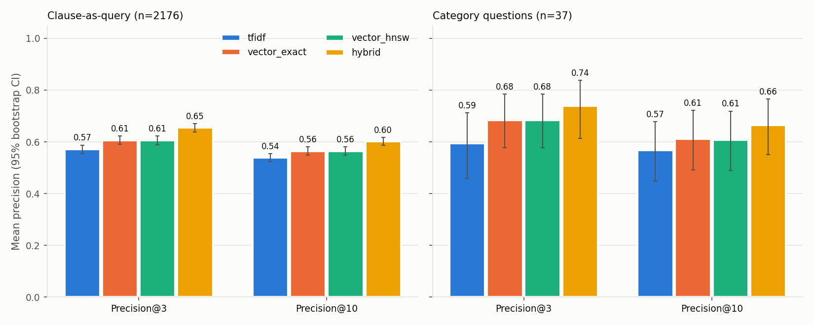
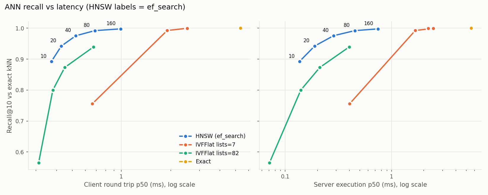

# Retrieval benchmark: local

Source: `20261001T165752Z_local.json`. Design: `bench/PREREGISTRATION.md`. Corpus stats: `bench/corpus/cuad_corpus_meta.json`.

## Environment

| Field | Value |
|---|---|
| Environment | local |
| Timestamp (UTC) | 2026-10-01T16:55:20.222299+00:00 |
| Host | local Docker |
| Azure SKU |  |
| Postgres | PostgreSQL 16.15 (Debian 16.15-1.pgdg12+2) on aarch64-unknown-linux-gnu, compiled by gcc (Debian 12.2.0-14+deb12u1) 12.2.0, 64-bit |
| pgvector | 0.8.6 |
| SSL in use | False |
| Client CPU | Apple M5 |
| Client CPUs visible | 10 |
| Docker resources | 10 CPUs, 8319504384 bytes memory |
| shared_buffers / work_mem / maintenance_work_mem | 128MB / 4MB / 64MB |
| max_parallel_maintenance_workers | 2 |
| Reference rows / eval rows | 6766 / 1924 |
| Embedding model | sentence-transformers/all-MiniLM-L6-v2 @ 1110a243fdf4706b3f48f1d95db1a4f5529b4d41 |
| Seed | 42 |
| Git commit | 785a8c26b98beef44c3643bc09b89d9e12e39475 (dirty files: 0) |

## A. Retrieval quality (eval split -> reference split)

### Clause-as-query (2176 queries, 1924 distinct texts)

| Method | P@3 [95% CI] | P@10 [95% CI] | mrr@10 | ndcg@10 | hit_rate@3 | hit_rate@10 | recall@10 | max_recall@10 |
|---|---|---|---|---|---|---|---|---|
| tfidf | 0.571 [0.555, 0.587] | 0.539 [0.524, 0.554] | 0.698 | 0.551 | 0.767 | 0.886 | 0.022 | 0.050 |
| vector_exact | 0.606 [0.590, 0.623] | 0.564 [0.550, 0.580] | 0.720 | 0.578 | 0.784 | 0.900 | 0.022 | 0.050 |
| vector_hnsw | 0.606 [0.589, 0.623] | 0.565 [0.550, 0.581] | 0.717 | 0.578 | 0.780 | 0.892 | 0.022 | 0.050 |
| hybrid | 0.655 [0.638, 0.670] | 0.602 [0.586, 0.617] | 0.759 | 0.619 | 0.821 | 0.915 | 0.025 | 0.050 |

Hybrid HNSW leg: minimum candidates returned = 49.
Categories without queries in this set: Price Restrictions.

Weakest 5 categories by P@10:

| Method | Categories (P@10, n queries) |
|---|---|
| tfidf | Competitive Restriction Exception (0.036, n=22); Most Favored Nation (0.080, n=10); Affiliate License-Licensee (0.112, n=25); No-Solicit Of Customers (0.140, n=5); Unlimited/All-You-Can-Eat-License (0.150, n=4) |
| vector_exact | Most Favored Nation (0.020, n=10); Competitive Restriction Exception (0.036, n=22); Unlimited/All-You-Can-Eat-License (0.050, n=4); Affiliate License-Licensor (0.100, n=20); No-Solicit Of Customers (0.100, n=5) |
| vector_hnsw | Most Favored Nation (0.010, n=10); Competitive Restriction Exception (0.036, n=22); Unlimited/All-You-Can-Eat-License (0.050, n=4); Affiliate License-Licensor (0.080, n=20); No-Solicit Of Customers (0.100, n=5) |
| hybrid | Competitive Restriction Exception (0.041, n=22); Most Favored Nation (0.070, n=10); Unlimited/All-You-Can-Eat-License (0.100, n=4); Affiliate License-Licensor (0.110, n=20); No-Solicit Of Customers (0.120, n=5) |

Per-category P@10 (clause-as-query):

| Category | n | tfidf | vector_exact | vector_hnsw | hybrid |
|---|---|---|---|---|---|
| Affiliate License-Licensee | 25 | 0.112 | 0.236 | 0.208 | 0.196 |
| Affiliate License-Licensor | 20 | 0.155 | 0.100 | 0.080 | 0.110 |
| Anti-Assignment | 119 | 0.833 | 0.854 | 0.851 | 0.870 |
| Audit Rights | 156 | 0.659 | 0.857 | 0.865 | 0.824 |
| Cap On Liability | 148 | 0.759 | 0.837 | 0.837 | 0.842 |
| Change Of Control | 50 | 0.486 | 0.326 | 0.332 | 0.452 |
| Competitive Restriction Exception | 22 | 0.036 | 0.036 | 0.036 | 0.041 |
| Covenant Not To Sue | 36 | 0.428 | 0.350 | 0.353 | 0.442 |
| Exclusivity | 94 | 0.297 | 0.231 | 0.241 | 0.290 |
| Expiration Date | 94 | 0.809 | 0.896 | 0.896 | 0.903 |
| Governing Law | 91 | 0.955 | 0.957 | 0.957 | 0.974 |
| Insurance | 135 | 0.831 | 0.868 | 0.873 | 0.886 |
| Ip Ownership Assignment | 62 | 0.348 | 0.460 | 0.461 | 0.458 |
| Irrevocable Or Perpetual License | 56 | 0.295 | 0.312 | 0.304 | 0.411 |
| Joint Ip Ownership | 25 | 0.576 | 0.604 | 0.604 | 0.624 |
| License Grant | 178 | 0.560 | 0.623 | 0.625 | 0.645 |
| Liquidated Damages | 48 | 0.415 | 0.408 | 0.408 | 0.487 |
| Minimum Commitment | 90 | 0.294 | 0.344 | 0.343 | 0.369 |
| Most Favored Nation | 10 | 0.080 | 0.020 | 0.010 | 0.070 |
| No-Solicit Of Customers | 5 | 0.140 | 0.100 | 0.100 | 0.120 |
| No-Solicit Of Employees | 14 | 0.614 | 0.614 | 0.614 | 0.721 |
| Non-Compete | 58 | 0.262 | 0.141 | 0.138 | 0.200 |
| Non-Disparagement | 8 | 0.237 | 0.213 | 0.237 | 0.338 |
| Non-Transferable License | 74 | 0.397 | 0.305 | 0.305 | 0.386 |
| Notice Period To Terminate Renewal | 23 | 0.543 | 0.648 | 0.648 | 0.648 |
| Post-Termination Services | 113 | 0.368 | 0.407 | 0.410 | 0.462 |
| Renewal Term | 39 | 0.615 | 0.672 | 0.674 | 0.697 |
| Revenue/Profit Sharing | 87 | 0.538 | 0.583 | 0.585 | 0.631 |
| Rofr/Rofo/Rofn | 68 | 0.351 | 0.206 | 0.201 | 0.306 |
| Source Code Escrow | 30 | 0.560 | 0.353 | 0.343 | 0.553 |
| Termination For Convenience | 53 | 0.609 | 0.570 | 0.570 | 0.672 |
| Third Party Beneficiary | 9 | 0.467 | 0.233 | 0.233 | 0.489 |
| Uncapped Liability | 36 | 0.478 | 0.569 | 0.569 | 0.644 |
| Unlimited/All-You-Can-Eat-License | 4 | 0.150 | 0.050 | 0.050 | 0.100 |
| Volume Restriction | 46 | 0.193 | 0.261 | 0.241 | 0.254 |
| Warranty Duration | 50 | 0.518 | 0.576 | 0.582 | 0.614 |

### CUAD category questions (37 queries, 37 distinct texts)

| Method | P@3 [95% CI] | P@10 [95% CI] | mrr@10 | ndcg@10 | hit_rate@3 | hit_rate@10 | recall@10 | max_recall@10 |
|---|---|---|---|---|---|---|---|---|
| tfidf | 0.595 [0.459, 0.712] | 0.568 [0.449, 0.678] | 0.693 | 0.573 | 0.757 | 0.892 | 0.052 | 0.107 |
| vector_exact | 0.685 [0.577, 0.784] | 0.611 [0.492, 0.722] | 0.796 | 0.630 | 0.946 | 0.973 | 0.052 | 0.107 |
| vector_hnsw | 0.685 [0.577, 0.784] | 0.608 [0.489, 0.719] | 0.793 | 0.628 | 0.946 | 0.946 | 0.052 | 0.107 |
| hybrid | 0.739 [0.613, 0.838] | 0.665 [0.551, 0.765] | 0.837 | 0.688 | 0.892 | 0.919 | 0.059 | 0.107 |

Hybrid HNSW leg: minimum candidates returned = 49.

Weakest 5 categories by P@10:

| Method | Categories (P@10, n queries) |
|---|---|
| tfidf | Affiliate License-Licensee (0.000, n=1); Affiliate License-Licensor (0.000, n=1); Exclusivity (0.000, n=1); Most Favored Nation (0.000, n=1); License Grant (0.100, n=1) |
| vector_exact | Most Favored Nation (0.000, n=1); Affiliate License-Licensor (0.100, n=1); Exclusivity (0.100, n=1); Non-Transferable License (0.100, n=1); Price Restrictions (0.100, n=1) |
| vector_hnsw | Exclusivity (0.000, n=1); Most Favored Nation (0.000, n=1); Affiliate License-Licensor (0.100, n=1); Non-Transferable License (0.100, n=1); Price Restrictions (0.100, n=1) |
| hybrid | Exclusivity (0.000, n=1); Most Favored Nation (0.000, n=1); Volume Restriction (0.000, n=1); Affiliate License-Licensee (0.100, n=1); Affiliate License-Licensor (0.200, n=1) |

EXPLAIN check: vector_exact nodes ['Limit', 'Sort', 'Seq Scan'] (HNSW used: False); vector_hnsw nodes ['Limit', 'Index Scan'] (HNSW used: True).

## B. ANN index tradeoffs

| Index | Build (s) | Size (bytes) | DDL |
|---|---|---|---|
| ix_reference_clauses_embedding_hnsw | 0.67 | 13754368 | `CREATE INDEX ix_reference_clauses_embedding_hnsw ON reference_clauses USING hnsw (embedding vector_cosine_ops) WITH (m = 16, ef_construction = 64)` |
| bench_ivfflat_l7 | 0.11 | 11132928 | `CREATE INDEX bench_ivfflat_l7 ON reference_clauses USING ivfflat (embedding vector_cosine_ops) WITH (lists = 7)` |
| bench_ivfflat_l82 | 0.42 | 11468800 | `CREATE INDEX bench_ivfflat_l82 ON reference_clauses USING ivfflat (embedding vector_cosine_ops) WITH (lists = 82)` |

1924 timed queries per configuration (after warmup).

| Config | Recall@10 vs exact | Client p50 ms | p95 | p99 | QPS | Server exec p50 ms | p95 | p99 | Plan check | Planner picks it unforced |
|---|---|---|---|---|---|---|---|---|---|---|
| exact | 1.0000 | 5.36 | 6.83 | 9.39 | 178.4 | 5.601 | 6.705 | 9.105 | yes | yes |
| hnsw ef_search=10 | 0.8922 | 0.37 | 0.44 | 0.49 | 2639.1 | 0.136 | 0.205 | 0.250 | yes | yes |
| hnsw ef_search=20 | 0.9422 | 0.43 | 0.51 | 0.55 | 2313.7 | 0.189 | 0.273 | 0.310 | yes | yes |
| hnsw ef_search=40 | 0.9754 | 0.53 | 0.64 | 0.70 | 1901.5 | 0.284 | 0.394 | 0.431 | yes | yes |
| hnsw ef_search=80 | 0.9920 | 0.69 | 0.85 | 0.91 | 1467.2 | 0.451 | 0.613 | 0.668 | yes | yes |
| hnsw ef_search=160 | 0.9975 | 0.99 | 1.22 | 1.31 | 1040.0 | 0.745 | 0.975 | 1.040 | yes | yes |
| ivfflat lists=7 probes=1 | 0.7558 | 0.66 | 1.03 | 1.50 | 1444.2 | 0.403 | 0.462 | 0.522 | yes | yes |
| ivfflat lists=7 probes=5 | 0.9923 | 1.91 | 2.20 | 2.23 | 519.1 | 1.667 | 2.014 | 2.791 | yes | no (Limit, Sort, Seq Scan) |
| ivfflat lists=7 probes=10 (scans all lists) | 0.9992 | 2.51 | 3.55 | 5.01 | 369.2 | 2.455 | 3.863 | 5.005 | yes | no (Limit, Sort, Seq Scan) |
| ivfflat lists=7 probes=20 (scans all lists) | 0.9992 | 2.53 | 3.20 | 4.04 | 376.5 | 2.207 | 2.288 | 2.493 | yes | no (Limit, Sort, Seq Scan) |
| ivfflat lists=82 probes=1 | 0.5649 | 0.31 | 0.35 | 0.41 | 3167.8 | 0.071 | 0.100 | 0.111 | yes | yes |
| ivfflat lists=82 probes=3 | 0.8000 | 0.38 | 0.45 | 0.50 | 2596.8 | 0.140 | 0.189 | 0.210 | yes | yes |
| ivfflat lists=82 probes=5 | 0.8729 | 0.45 | 0.52 | 0.54 | 2227.1 | 0.211 | 0.274 | 0.291 | yes | yes |
| ivfflat lists=82 probes=10 | 0.9392 | 0.67 | 0.90 | 1.21 | 1441.1 | 0.399 | 0.503 | 0.582 | yes | yes |

Indexed configs are measured with enable_seqscan=off so the index is exercised; the last column shows whether the planner would use the index without that.

Indexes restored to start state: True.

## B. Filtered vector search

Iterative scan supported: True. 200 queries per category.

Cells: recall@10 vs exact filtered / mean result count (indexes in plan).

| Group | Category | Ref rows | planner_default | hnsw_forced | hnsw_forced_iterative_relaxed_order | hnsw_forced_iterative_strict_order |
|---|---|---|---|---|---|---|
| most_frequent | License Grant | 599 | 0.244 / 2.5 (ix_reference_clauses_embedding_hnsw) | 0.244 / 2.5 (ix_reference_clauses_embedding_hnsw) | 0.971 / 10.0 (ix_reference_clauses_embedding_hnsw) | 0.922 / 10.0 (ix_reference_clauses_embedding_hnsw) |
| most_frequent | Anti-Assignment | 535 | 0.261 / 2.7 (ix_reference_clauses_embedding_hnsw) | 0.261 / 2.7 (ix_reference_clauses_embedding_hnsw) | 0.968 / 10.0 (ix_reference_clauses_embedding_hnsw) | 0.902 / 10.0 (ix_reference_clauses_embedding_hnsw) |
| most_frequent | Cap On Liability | 524 | 0.174 / 1.8 (ix_reference_clauses_embedding_hnsw) | 0.174 / 1.8 (ix_reference_clauses_embedding_hnsw) | 0.967 / 10.0 (ix_reference_clauses_embedding_hnsw) | 0.897 / 10.0 (ix_reference_clauses_embedding_hnsw) |
| most_frequent | Audit Rights | 487 | 0.115 / 1.2 (ix_reference_clauses_embedding_hnsw) | 0.115 / 1.2 (ix_reference_clauses_embedding_hnsw) | 0.979 / 10.0 (ix_reference_clauses_embedding_hnsw) | 0.926 / 10.0 (ix_reference_clauses_embedding_hnsw) |
| most_frequent | Insurance | 425 | 0.100 / 1.0 (ix_reference_clauses_embedding_hnsw) | 0.100 / 1.0 (ix_reference_clauses_embedding_hnsw) | 0.975 / 10.0 (ix_reference_clauses_embedding_hnsw) | 0.909 / 10.0 (ix_reference_clauses_embedding_hnsw) |
| most_frequent | Expiration Date | 373 | 0.175 / 1.8 (ix_reference_clauses_embedding_hnsw) | 0.175 / 1.8 (ix_reference_clauses_embedding_hnsw) | 0.943 / 10.0 (ix_reference_clauses_embedding_hnsw) | 0.887 / 10.0 (ix_reference_clauses_embedding_hnsw) |
| most_frequent | Governing Law | 373 | 0.060 / 0.6 (ix_reference_clauses_embedding_hnsw) | 0.060 / 0.6 (ix_reference_clauses_embedding_hnsw) | 0.919 / 10.0 (ix_reference_clauses_embedding_hnsw) | 0.765 / 10.0 (ix_reference_clauses_embedding_hnsw) |
| most_frequent | Post-Termination Services | 337 | 1.000 / 10.0 (ix_reference_clauses_categories) | 0.170 / 1.7 (ix_reference_clauses_embedding_hnsw) | 0.979 / 10.0 (ix_reference_clauses_embedding_hnsw) | 0.935 / 10.0 (ix_reference_clauses_embedding_hnsw) |
| most_frequent | Minimum Commitment | 334 | 1.000 / 10.0 (ix_reference_clauses_categories) | 0.102 / 1.0 (ix_reference_clauses_embedding_hnsw) | 0.984 / 10.0 (ix_reference_clauses_embedding_hnsw) | 0.946 / 10.0 (ix_reference_clauses_embedding_hnsw) |
| most_frequent | Revenue/Profit Sharing | 331 | 1.000 / 10.0 (ix_reference_clauses_categories) | 0.092 / 0.9 (ix_reference_clauses_embedding_hnsw) | 0.988 / 10.0 (ix_reference_clauses_embedding_hnsw) | 0.953 / 10.0 (ix_reference_clauses_embedding_hnsw) |
| least_frequent | No-Solicit Of Employees | 77 | 1.000 / 10.0 (ix_reference_clauses_categories) | 0.020 / 0.2 (ix_reference_clauses_embedding_hnsw) | 0.996 / 10.0 (ix_reference_clauses_embedding_hnsw) | 0.976 / 10.0 (ix_reference_clauses_embedding_hnsw) |
| least_frequent | Liquidated Damages | 73 | 1.000 / 10.0 (ix_reference_clauses_categories) | 0.043 / 0.4 (ix_reference_clauses_embedding_hnsw) | 0.995 / 10.0 (ix_reference_clauses_embedding_hnsw) | 0.970 / 10.0 (ix_reference_clauses_embedding_hnsw) |
| least_frequent | Non-Disparagement | 57 | 1.000 / 10.0 (ix_reference_clauses_categories) | 0.020 / 0.2 (ix_reference_clauses_embedding_hnsw) | 0.998 / 10.0 (ix_reference_clauses_embedding_hnsw) | 0.985 / 10.0 (ix_reference_clauses_embedding_hnsw) |
| least_frequent | No-Solicit Of Customers | 53 | 1.000 / 10.0 (ix_reference_clauses_categories) | 0.025 / 0.3 (ix_reference_clauses_embedding_hnsw) | 0.995 / 10.0 (ix_reference_clauses_embedding_hnsw) | 0.979 / 10.0 (ix_reference_clauses_embedding_hnsw) |
| least_frequent | Affiliate License-Licensor | 49 | 1.000 / 10.0 (ix_reference_clauses_categories) | 0.037 / 0.4 (ix_reference_clauses_embedding_hnsw) | 0.998 / 10.0 (ix_reference_clauses_embedding_hnsw) | 0.972 / 10.0 (ix_reference_clauses_embedding_hnsw) |
| least_frequent | Source Code Escrow | 36 | 1.000 / 10.0 (ix_reference_clauses_categories) | 0.018 / 0.2 (ix_reference_clauses_embedding_hnsw) | 1.000 / 10.0 (ix_reference_clauses_embedding_hnsw) | 0.980 / 10.0 (ix_reference_clauses_embedding_hnsw) |
| least_frequent | Third Party Beneficiary | 30 | 1.000 / 10.0 (ix_reference_clauses_categories) | 0.006 / 0.1 (ix_reference_clauses_embedding_hnsw) | 0.999 / 10.0 (ix_reference_clauses_embedding_hnsw) | 0.988 / 10.0 (ix_reference_clauses_embedding_hnsw) |
| least_frequent | Most Favored Nation | 28 | 1.000 / 10.0 (ix_reference_clauses_categories) | 0.014 / 0.1 (ix_reference_clauses_embedding_hnsw) | 0.995 / 10.0 (ix_reference_clauses_embedding_hnsw) | 0.975 / 10.0 (ix_reference_clauses_embedding_hnsw) |
| least_frequent | Unlimited/All-You-Can-Eat-License | 28 | 1.000 / 10.0 (ix_reference_clauses_categories) | 0.013 / 0.1 (ix_reference_clauses_embedding_hnsw) | 1.000 / 10.0 (ix_reference_clauses_embedding_hnsw) | 0.994 / 10.0 (ix_reference_clauses_embedding_hnsw) |
| least_frequent | Price Restrictions | 27 | 1.000 / 10.0 (ix_reference_clauses_categories) | 0.006 / 0.1 (ix_reference_clauses_embedding_hnsw) | 1.000 / 10.0 (ix_reference_clauses_embedding_hnsw) | 0.994 / 10.0 (ix_reference_clauses_embedding_hnsw) |

## C. End-to-end (sample_contract.pdf)

20 timed runs after 3 warmup. Clauses: 4, priority: 3, classifier: dummy, retriever: hybrid, related: 9, precedents: 9. insert is rolled back; classify uses the app's default classifier chain.

| Stage | Median ms | p95 ms |
|---|---|---|
| extract | 112.78 | 213.69 |
| segment | 0.43 | 0.67 |
| classify | 1.10 | 1.26 |
| embed | 75.89 | 89.93 |
| insert | 1.87 | 1.90 |
| retrieve | 143.12 | 232.55 |
| total (median of per-run sums) | 346.39 |  |

